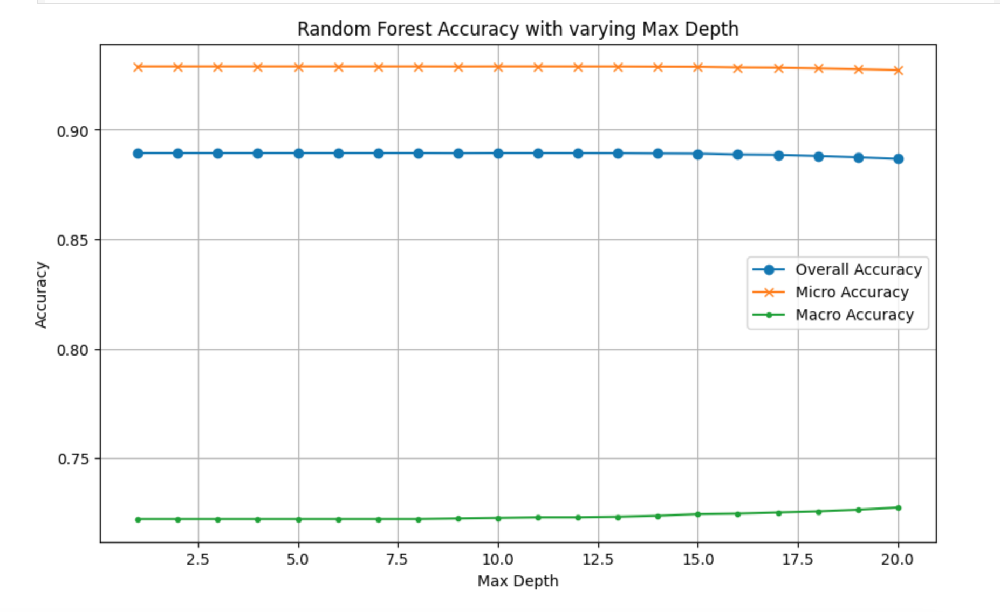
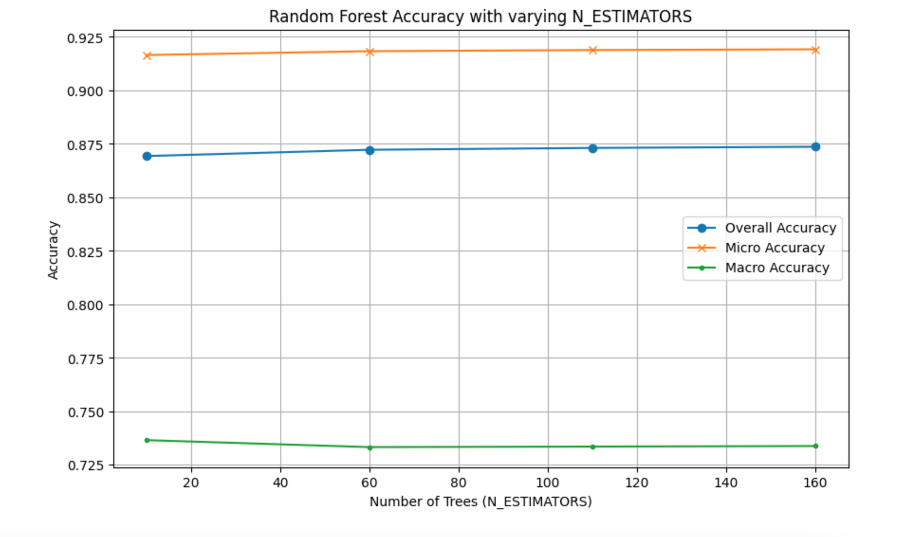

# This project uses classification techniques (KNN, Random Forest) to predict the presence of heart and kidney diseases. 

## Data Preparation: 
In the given data set, heart_2020_cleaned_comb_num.csv, there are overall 16 attributes and HD_KD as the response variable. With number 16, it is sufficient enough to treat it as a high-dimensional dataset. To speed up the process of classification, I performed PCA dimension reduction in both KNN and Random Forest classification. 

## KNN assessment: 
In KNN, I test the performance accuracy by changing the hyperparameter, the number of neighbors (k). From the graph, we can see that overall, micro-accuracy has the highest value, which is an average of 0.95, and macro-accuracy has the lowest value. 
For all three accuracy values (macro, micro, and overall), The accuracy increases when K increases from 1 to 2, but stays relatively stable after increasing k values. 

Specifically, when K = 5, macro accuracy = 0.731, micro accuracy = 0.924, and overall accuracy = 0.881. 

It is interesting to note that this dataset is highly imbalanced, with class 1 occupying about 89% of all the data points. And from the graph, micro statistics have higher values than macro statistics, which indicates that the model is almost perfect at predicting the majority class while relatively poorly predicting the minority class. But as the difference between maco and mico accuracy is not significant, it indicates that the model’s good performance on the majority class is compensating for its poor performance on the minority class. 

## Random Forest Assessment: 

For random forest, the performance measurement statistics are pretty close to what we obtained in KNN. when the parameter N_estimators is set to 100 and Min_Samples_split is set to 2. We get macro-accuracy = 0.919, micro-statistical accuracy = 0.734, and overall accuracy = 0.873.  

I changed two parameters that directly affect the performance of classification: 
1. N_estimators (the number of trees in the forest) 2. Max_depth (the depth of the tree) 
But surprisingly, changing the value of the parameter does not make a significant difference in the accuracy values. Microstatistics still has the highest value over the three accuracies, which indicates that in a random forest model, the performance is better when conducting predictions on the majority class than it was in the minority class.

